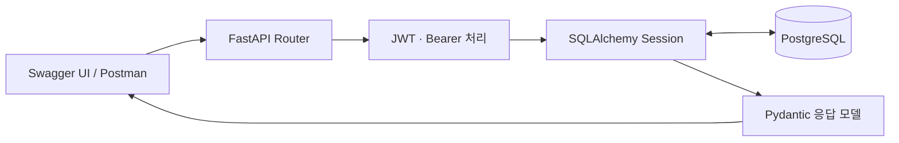

# 집찍고 MINI · 백엔드 실습

**집찍고 백엔드의 데이터 모델과 일부 API 구조를 활용해, 서버 실행부터 인증·DB 마이그레이션·컨테이너 구성까지 실습한 프로젝트입니다.**

스팩스페이스 현장실습 초기인 **2025년 6~7월**, 제공받은 MINI 베이스 코드를 분석하고 기능을 확장했습니다.
각 단계에서 기술의 역할, 발생한 오류와 해결 과정, 실제 집찍고 코드와의 차이를 정리해 발표했습니다.
운영 앱 전체나 이후 수행한 폴더 순환 참조·휴지통 장애 수정본을 담은 저장소는 아닙니다.

## 실습 흐름

| 단계 | 진행한 내용 | 관련 코드 |
| --- | --- | --- |
| 1. 서버 구조 | FastAPI·Uvicorn 실행, 라우터 연결과 요청·응답 흐름 분석, Swagger UI·Postman 테스트 | [main.py](app/main.py), [라우터 연결](app/routes/__init__.py) |
| 2. DB 연동 | SQLite 연결 확인 후 로컬 PostgreSQL 구성, Engine·Session·모델 관계 이해 | [engine.py](app/database/engine.py), [get_db.py](app/database/get_db.py), [models](app/models) |
| 3. CRUD·스키마 | 사용자 API 확장, Item 생성·조회 실습, Pydantic 응답 검증과 직렬화 확인 | [user.py](app/routes/user.py), [item.py](app/routes/item.py), [schemas](app/schemas) |
| 4. 인증 | Access·Refresh 토큰 발급, Bearer 헤더 처리, `perm`에 따른 플랫폼·사용자 권한 분기 | [auth.py](app/functions/auth.py), [platform.py](app/routes/platform.py) |
| 5. 마이그레이션 | 모델 컬럼 변경, Alembic 리비전·upgrade·downgrade 실습, 기존 데이터 보정 | [alembic/versions](alembic/versions) |
| 6. 컨테이너 | Dockerfile 작성, 앱·DB 컨테이너 분리, Compose 네트워크·볼륨·기동 순서 구성 | [Dockerfile](Dockerfile), [docker-compose.yml](docker-compose.yml) |

현재 API는 `/api/users`, `/api/platforms`, `/api/items` 중심입니다.
폴더·이미지·파일·메모·통계 모델은 데이터 관계를 이해하는 기반으로 포함되어 있습니다.

인증은 해당 의존성이 지정된 API에 적용됩니다. 플랫폼 최초 생성 경로는 실습을 위해 단순화했습니다.

## 실습에서 다룬 문제

- **요청 경로와 응답 모델:** 루트(`/`)의 404를 라우터·prefix 설정으로 확인하고 `/docs`에서 API를 테스트했습니다. Pydantic v2의 `from_attributes` 설정과 모델·스키마 사이 날짜 타입 불일치를 살펴봤습니다.
- **인증 형식과 권한의 분리:** 역할 이름을 헤더 접두사로 사용하는 방식에서 Bearer 헤더를 처리하고, 토큰 내부 `perm`으로 권한을 구분하는 흐름을 구현했습니다.
- **마이그레이션 상태 불일치:** `stamp`가 실제 스키마를 바꾸지 않는다는 점을 오류를 통해 확인하고, 리비전 표시와 `upgrade`·`downgrade`의 차이를 정리했습니다.
- **컨테이너의 DB 연결:** 컨테이너 내부 `localhost`가 호스트 DB를 가리키지 않는 문제를 분석했습니다. 호스트 연결 방식과 Compose의 `DB_HOST=db` 서비스 이름 연결 방식을 실습했습니다.

날짜 타입 통일 등 발표에서 제안한 개선안이 모두 현재 코드에 반영된 것은 아닙니다.

## 추가 실습 · 자연어 DB 도구

[tool_agent.py](tool_agent.py)와 [tools.yaml](tools.yaml)은 Google ADK·Toolbox for Databases를 이용한 별도 실험입니다.
사용자 CRUD를 SQL 도구로 정의하고 자연어 요청으로 사용자를 검색하는 흐름을 확인했습니다.
SQL 도구 안에서 Python 함수를 직접 사용할 수 없는 제약과 연동 오류도 기록했습니다.
기본 FastAPI 서비스와는 별도로 실행하는 프로토타입입니다.

## 로컬 실행

Docker Compose가 필요합니다.

1. `.env.example`을 `.env`로 복사합니다.
2. `.env`의 `DB_PASS`와 `JWT_SECRET_KEY`를 본인의 로컬용 값으로 바꿉니다.
3. `docker compose up --build`를 실행합니다.
4. `http://localhost:8000/docs`에서 API를 확인합니다.

빈 DB 볼륨으로 최초 실행할 때 `db-image/example.sql`의 스키마와 가상 데이터가 입력됩니다.
예제는 `example-platform`, `example-user`, `example-root` 등의 가상 식별자만 사용합니다.
기존 볼륨에는 초기화 SQL이 다시 실행되지 않습니다.

## 공개 데이터 구성

기존 PostgreSQL 데이터 디렉터리·SQL 덤프·SQLite DB를 제거하고 모델 정의로 만든 스키마와
가상 예제로 대체했습니다. 기존 접속값·서명 키·DB 파일은 공개 브랜치의 과거 커밋에서도 정리했습니다.
실행 중 생성되는 DB와 `.env`는 Git에 포함하지 않습니다.

## 실습 범위

이 코드는 학습 당시의 구현을 보존합니다. JWT 만료 검증이 꺼진 부분 등 운영 배포 전에
보완할 내용이 있으므로 로컬 실습용으로 사용합니다. Compose 포트도 로컬 호스트에만 바인딩합니다.
AI 도구 실습은 별도의 Google API 키와 ADK·Toolbox 실행 환경이 필요하며 기본 Compose에는 포함되지 않습니다.

## 예제 검증

`python scripts/build_example.py --check`로 모델 스키마와 예제 SQL의 일치 여부,
가상 데이터 입력과 외래키 관계를 메모리 SQLite에서 검사할 수 있습니다.
공개 준비 시 이 검사는 통과했으며, Docker·PostgreSQL 컨테이너 실행은 별도 검증이 필요합니다.

## 작성 근거

Notion의 `SFACSPACE → 6~7월 DO List`에 남긴 **집찍고 실습 Step 1~6**, **Step 1~6 발표**,
**집찍고 총 정리**, **Toolbox for Databases** 기록과 현재 저장소 코드를 대조해 작성했습니다.
당시 실습 기록과 현재 공개용 환경의 검증 결과는 구분했습니다.
